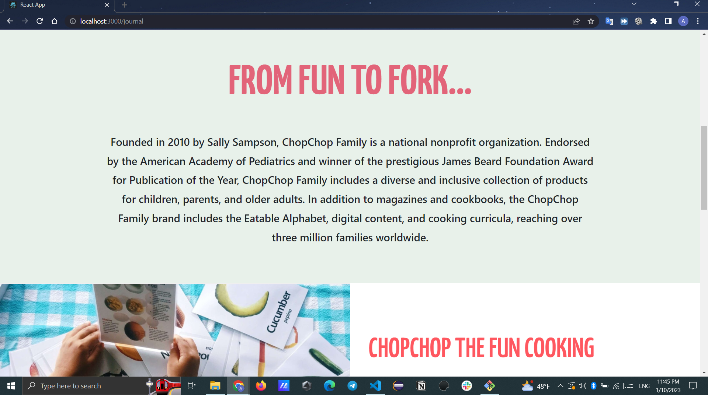

# Food_Recipes

This site will display the names of the meals, their ingredients, and the prices of the ingredients in the country of origin, i take data form API

## Details:

1. this app will have a 4 page as shown below

2. when user click on recipes new i will go to new page which have all recipes with name and you can make filter To see the right foods for you

<!--  -->
<!--  -->

3. when user click on recipe will display all information about this recipe in a new page like it

<!--  -->
<!--  -->
<!--  -->
<!--  -->
<!--  -->
<!--  -->

3. when user click on our story

<!--  -->
<!--  -->
<!--  -->
<!--  -->

3. when user click on contact us
   
