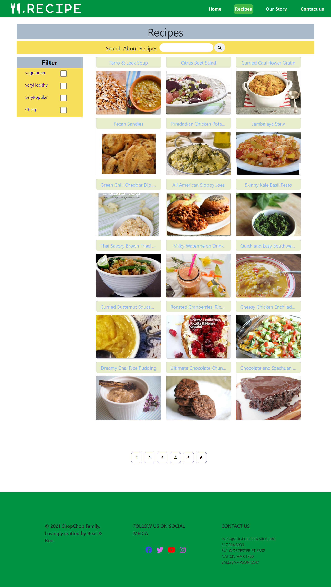
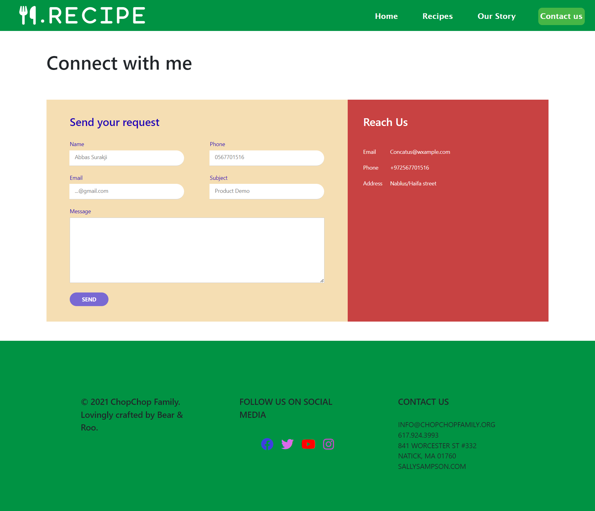
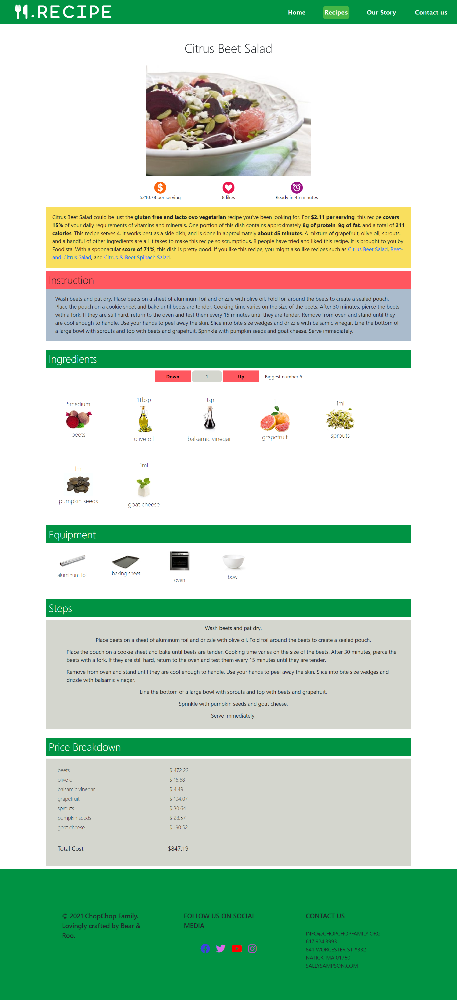
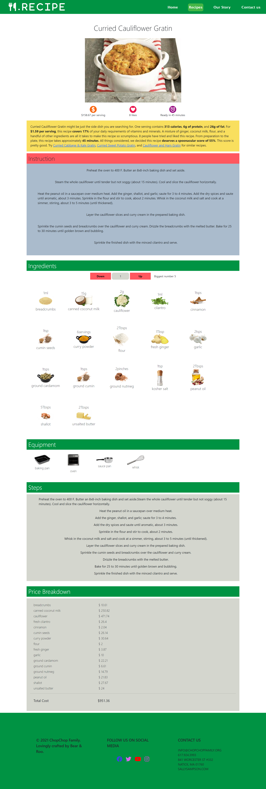
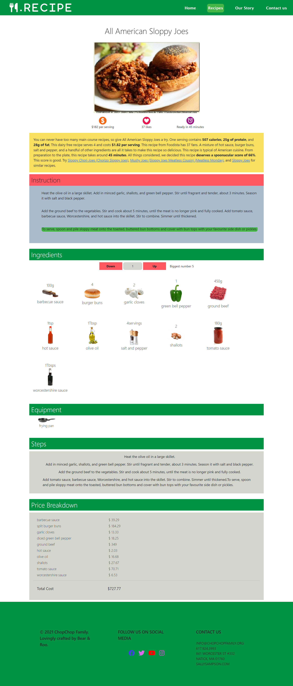

# Food_Recipes

This site will display the names of the meals, their ingredients, and the prices of the ingredients in the country of origin, i take data form API

## Details:

1. this app will have a 4 page as shown below

### A- Home Page

### B- Recipes Page

### C- Story Page

### D- Contact Page

## when user click on recipes new i will go to new page which have all recipes with name and you can make filter using name and checkbox and name with checkbox To see the right foods for you

## when user click on recipe will display all information about this recipe in a new page like it

## when user click on our story

## when user click on contact us 

